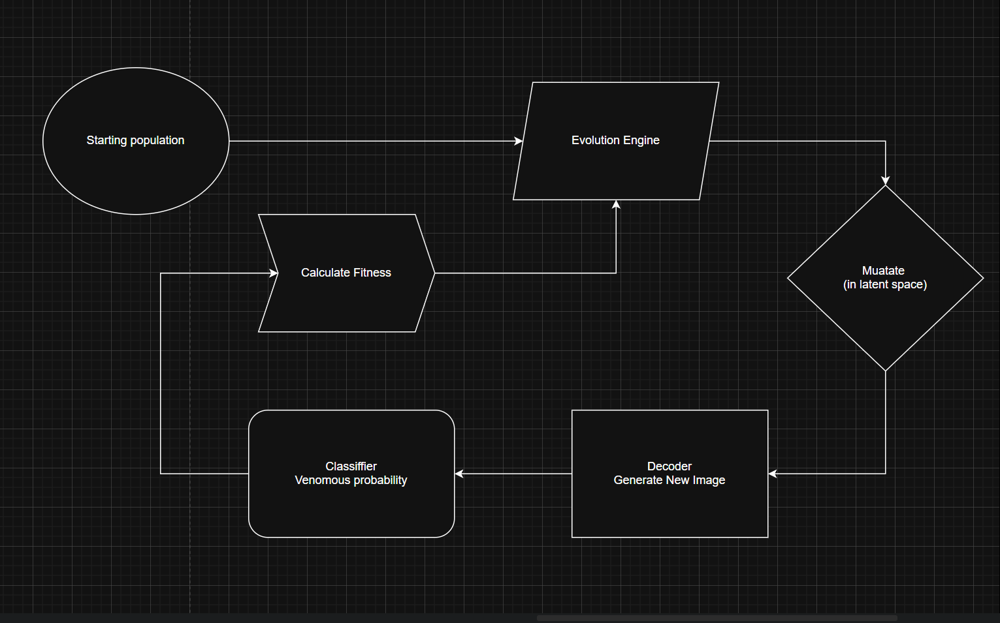
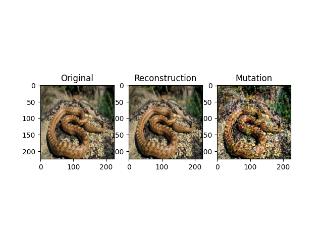
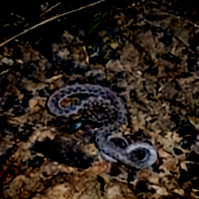
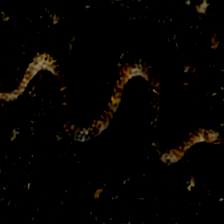

# Snake Mimicry Evolution

## Overview

This project explores whether **evolutionary algorithms combined with deep learning** can generate visual mimicry — specifically, making non-venomous snakes resemble venomous ones.

The system combines:

* a **latent-space Autoencoder**
* a **CNN classifier (venomous vs non-venomous)**
* an **evolutionary optimization process** operating in latent space

The ultimate goal was to simulate a simplified version of **Batesian mimicry** using learned visual representations.

---

## Motivation

In nature, some harmless species evolve to resemble dangerous ones to avoid predators.

This project attempts to answer:

> *Can a neural representation + evolutionary pressure produce similar behavior artificially?*

I was simply courious about that (😉) after watching mimicry YouTube video.

---

## Method




Models are better (more tech) explain in other Readme in ./model

### 1. Representation Learning

* Train an **Autoencoder** on snake images
* Encode images into a **latent space**
* Decode latent vectors back into images

### 2. Classification Model

* Train a classifier (based on ResNet50) to predict:

  * `0 → non-venomous`
  * `1 → venomous`

### 3. Evolutionary Process

* Initialize population from encoded real images
* Iterate over generations:

  * Decode latent vectors → images
  * Evaluate fitness using classifier
  * Select, mutate, and recombine individuals

---

## Fitness Function

The fitness function balances:

* **Classifier confidence** (want high venomous probability)
* **Diversity penalty** (avoid identical images - didn't work good enough, but more 'bout it later)
* **Color variance penalty** (tried to avoid changing background too much)

```
fitness = 
    + classifier_confidence
    - similarity_penalty
    - color_penalty
```

---

## Experiment Setup

**Hardware**

* GPU: RTX 3060 (laptop version) and I was able to borrow for one training RTX 4070 Super
* RAM: 16GB and 24GB
* Training time: Classifier - 2h, Autoencoder - one week

**Dataset**

* Source: Kaggle: https://www.kaggle.com/datasets/goelyash/165-different-snakes-species?resource=download
* Size: approximately 27k images: 24k train and 3k test - not well balanced with +/- 2:1 non-venomous to venomous. 
* Classes: venomous / non-venomous

---

## Results

### Autoencoder Reconstruction



---

### Evolution Sample

Generation 0:


Generation 4:


---

## Observations and insights

* The Autoencoder learend pretty good how to reconstruct the image, but:
  * learned **global texture and color distributions** instead of snakes.
* The classifier with 85% seems pretty good at first, but relies heavily on:
  * background, lighting and color cues in similar manner to Autoencoder
* Evolution tends to:
  * converge quickly (mode collapse)
  * exploit classifier shortcuts

Both issues with classifier and autoencoder could be resolve using segmentation 1st so models would learn solely on snakes without their background. Right now even human without knowledge can tell that snake in jungle or desert has high chance to be venomous making 85% not as impressive as on the 1st look.

Next thing to do is changing autoencoder with slighlty different approach using Variational Autoencoder, the problems are hardware limitations of my current setup. This simple ae here took me about week to train and thats not including times when after few days the overflow in gradients stop training proccess making me did some changes and train again. I tried using AWS, Azure or similar web services, but probably because I am new (accounts) and current AI world situation didn't let me GPU (or enough vCPU) to run this experiment.

We can grade overall project as:

> The system optimizes for *classifier perception*, not *biological realism*.

This leads to **adversarial-like artifacts** rather than true mimicry.

---

## Conclusion

While the system did not produce realistic mimicry, it successfully demonstrates:

* latent space manipulation
* evolutionary optimization over neural representations
* interaction between generative models and classifiers

## Future of this project

Right now I am putting it on hold at least as long I get my hands on better hardware or web services give me some credits. Main things to do when I will revive project are:
  * New model to do segmentation first
  * Change autoencoder to vae, diffusion or sth else I will learn in future
  * Some API so it can be tested on github page

---

## Tech Stack

* PyTorch
* Torchvision
* NumPy

---

## Author

Glartek
